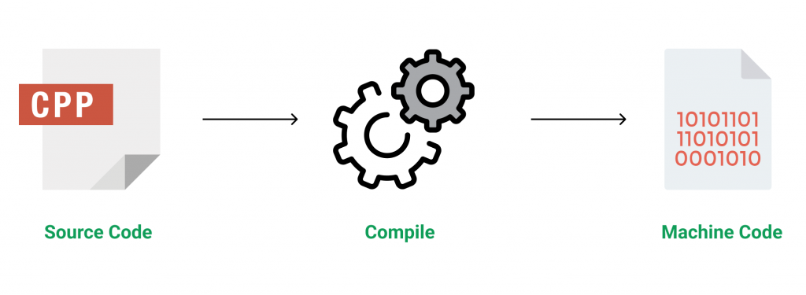
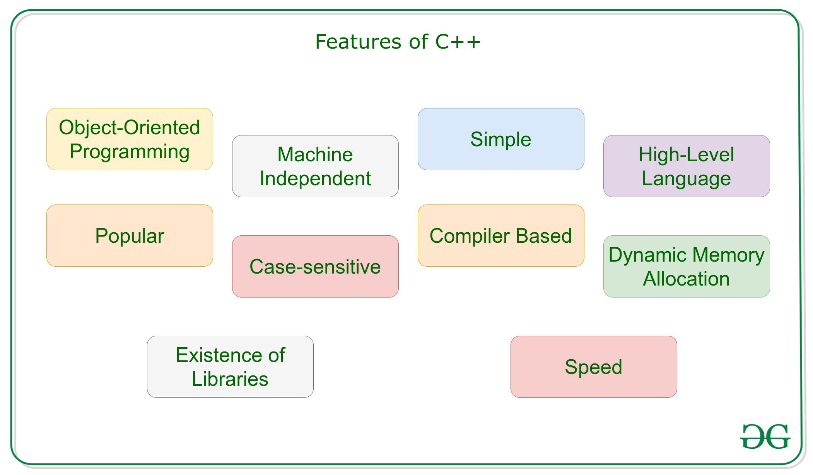
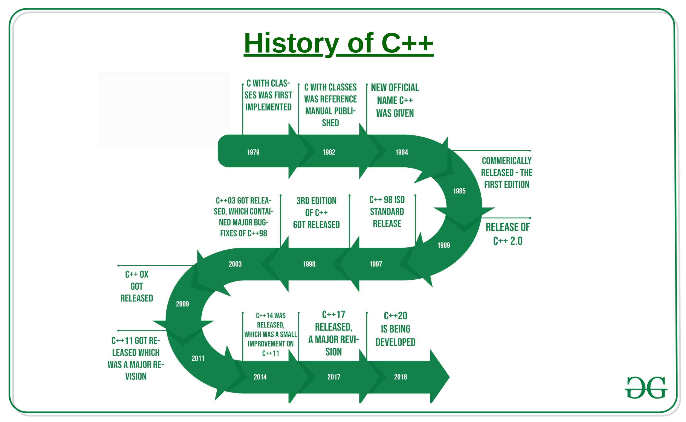
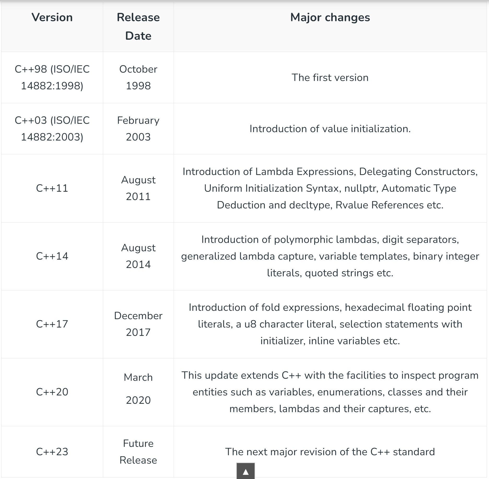
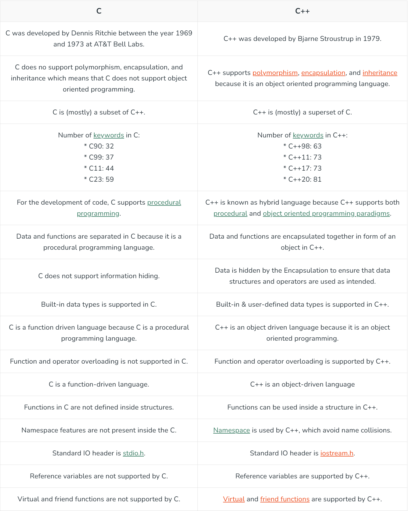
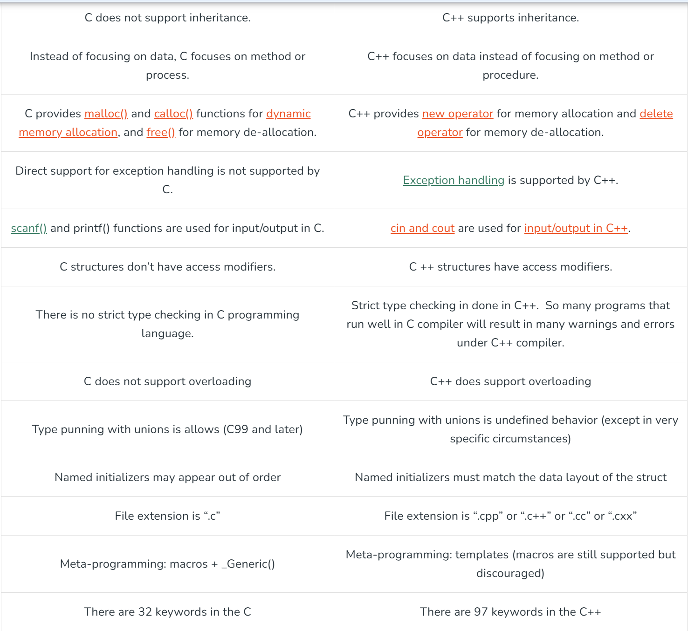

#C++ Basics
> [!NOTE]
    * Most popular cross-platform programming language.
    * Middle Level language 
    
    * Rich set of Libraries 
    * Its a Portable to adopt to multiple platforms.
    * Its machine independent but plantform dependent ( compiled program on linux(.exe) wont work on windows )
    * Used for OS, Games, E-commerce software, Embedded, Graphhics User interfacesm device driver,
    * High level of control over system resources and memory
    * Its OOPS(ojected Orieneted Programming language) implements all OOPs concepts such as 
        Abstraction
        Encapsulation
        Inheritance
    * Standard Template Library (STL)
    * Exception Handling 

>C++ Advantage 
    *Simple
    *Machine Indenpenden but platform Depenendt 
    *Mid-level language ( system program -drivers,kernel,Networks | user applications - media player, gaming, photoshop |
    Embedded System)
    *Rich Library ( build in struct, algorithms, | 3rd party - boost libraries)
    *speed (compiled language, no garbage collection, dynamic typing etc )
    * pointer and direct memory access
    *Object oriented

>Applications of C++
    *Operating Systems & Systems Programming. e.g. Linux-based OS (Ubuntu etc.)
    *Browsers (Chrome & Firefox)
    *Graphics & Game engines (Photoshop, Blender, Unreal-Engine)
    *Database Engines (MySQL, MongoDB, Redis etc.)
    *Cloud/Distributed Systems

>Disadvantages of C++
    * Challenege to Learn 
    * Verbose Syntax
    * Error prone ( access low-level system resorce so difficult to detect errors and fix it)

>Feature of C++

Multi-threading
    * Multithreading is a specialized form of multitasking and multitasking is a feature that allows your system to execute two or more programs concurrently. In general, there are two sorts of multitasking: process-based and thread-based.
    * Process-based multitasking handles the concurrent execution of programs. Thread-based multitasking deals with the multiprogramming of pieces of an equivalent program.
    * A multithreaded program contains two or more parts that will run concurrently. Each part of such a program is named a thread, and every thread defines a separate path of execution.
    * C++ doesn’t contain any built-in support for multithreaded applications. Instead, it relies entirely upon the OS to supply this feature
> History of C++ 

    * C++ ISO/IEC 14882:1998 - c++03 -c++11 - c++20 - c++ 23

